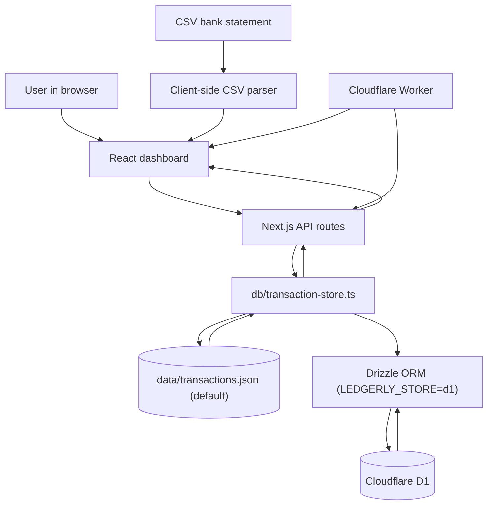
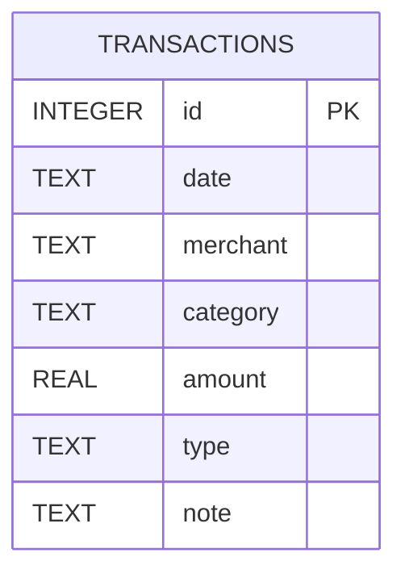
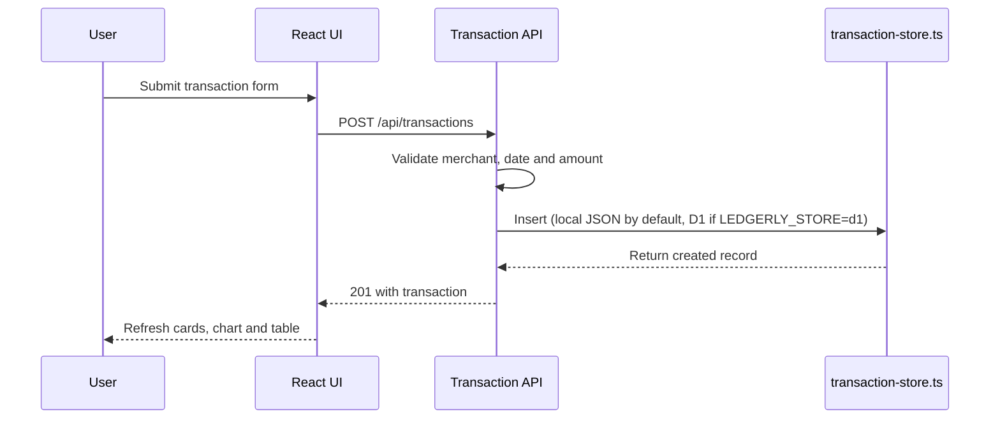
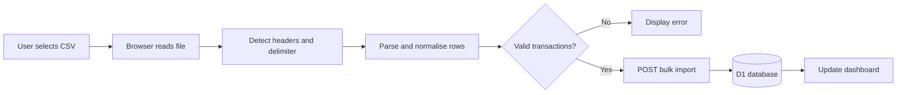
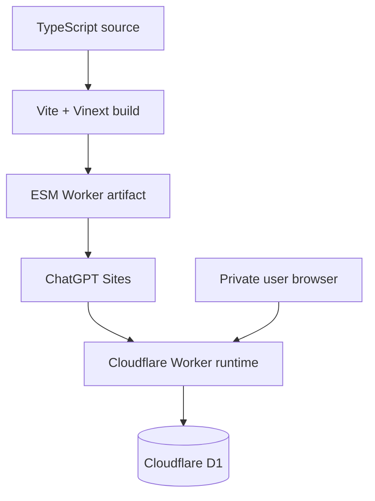

# Ledgerly Personal Expense Tracker

## Project Handover for Codex

This document provides the technical and functional context needed to continue
developing Ledgerly in VS Code with Codex or another coding agent.

## 1. Project overview

Ledgerly is a full-stack personal expense tracker. It allows a user to:

- View balance, income, spending and savings summaries.
- Add income and expense transactions manually.
- Import transactions from CSV bank statements.
- Edit and delete transactions.
- Search transactions by merchant or note.
- Filter transactions by category.
- View spending by category.
- See monthly budget progress.
- View a cumulative spending chart.
- Use the application on desktop, tablet and mobile.

The production site is:

<https://personal-expense-tracker.fsteyer.chatgpt.site>

The deployed site is configured for private access. The source ZIP does not
contain the production database or the user's online transaction records.

## 2. Current status

The application is a working first version rather than a finished banking
product.

Implemented:

- Responsive dashboard interface.
- Manual transaction creation.
- Transaction editing and deletion (with delete confirmation).
- CSV parsing and bulk insertion.
- Local JSON file persistence by default, with optional Cloudflare D1 persistence.
- Category summaries.
- Editable budget progress cards (create, edit and delete budgets/categories from the UI).
- User-created categories, with permanent starter categories plus user-added custom ones.
- Month and year filtering on the Dashboard and Transactions views, applied across KPIs, chart, budgets and the transaction table.
- A filtered-results totalizer (separate "Spent"/"Received" sums) next to the transaction search/category/month/year filters.
- Search and category filters.
- Basic API validation.
- Production deployment through ChatGPT Sites.

Not implemented:

- Direct bank or Open Banking connections.
- Recurring transactions.
- Multiple accounts.
- Multiple currencies.
- Arbitrary date-range selection (only whole month/year granularity today).
- CSV column-mapping interface.
- Duplicate-import detection.
- Automated transaction categorisation.
- Export to CSV or PDF.
- Comprehensive automated tests.

## 3. Technology stack

| Layer | Technology | Version | Responsibility |
| --- | --- | ---: | --- |
| Language | TypeScript | 5.9.3 | Front end, API routes, database schema and Worker |
| UI library | React | 19.2.6 | Components, state and user interactions |
| Full-stack framework | Next.js | 16.2.6 | App Router structure, metadata and API handlers |
| Next.js runtime adapter | Vinext | 0.0.50 | Builds the Next-style application for the Cloudflare runtime |
| Build tool | Vite | 8.0.13 | Local development and production bundling |
| Styling | Custom CSS | — | Complete dark responsive interface |
| CSS tooling | Tailwind CSS | 4.2.1 | Installed and configured, although the main UI uses custom CSS |
| API layer | Next.js route handlers | — | CRUD and bulk-import endpoints |
| Local storage | JSON file (`data/transactions.json`) | — | Default persistence for local development, read/written by `db/transaction-store.ts` |
| Database (optional) | Cloudflare D1 | SQLite-compatible | Used instead of the local JSON file only when `LEDGERLY_STORE=d1` and a Worker `DB` binding is available |
| ORM | Drizzle ORM | 0.45.2 | Typed database queries (D1 path only) |
| Migration tool | Drizzle Kit | 0.31.10 | SQL migration generation (D1 path only) |
| Runtime | Cloudflare Workers | — | Runs the deployed server application |
| Local Cloudflare tooling | Wrangler | 4.92.0 | Local Worker and D1 bindings |
| Linting | ESLint | 9.39.4 | Static code checks |
| Package manager | npm | lockfile included | Dependency installation |
| Minimum runtime | Node.js | 22.13.0 | Local development and build scripts |
| Hosting | ChatGPT Sites | — | Private production hosting and deployment |

## 4. High-level architecture



### Architectural responsibilities

- `app/page.tsx` owns nearly all dashboard UI and client-side application state,
  including budgets, custom categories and the month/year period filter.
- `app/globals.css` contains the full visual system and responsive layouts.
- `app/api/transactions` exposes the transaction API.
- `db/transaction-store.ts` is the storage abstraction: it reads/writes
  `data/transactions.json` by default, or delegates to Drizzle/D1 when
  `LEDGERLY_STORE=d1` is set and a Worker `DB` binding exists.
- `db/schema.ts` defines the transaction table (used only by the D1 path).
- `db/index.ts` provides the D1/Drizzle connection (used only by the D1 path).
- `worker/index.ts` is the Cloudflare Worker entry point.
- `vite.config.ts` configures Vinext, Sites and local Cloudflare bindings.

## 5. Repository structure

```text
ledgerly-personal-expense-tracker/
├── app/
│   ├── api/
│   │   └── transactions/
│   │       ├── [id]/
│   │       │   └── route.ts
│   │       ├── import/
│   │       │   └── route.ts
│   │       └── route.ts
│   ├── chatgpt-auth.ts
│   ├── globals.css
│   ├── layout.tsx
│   └── page.tsx
├── build/
│   └── sites-vite-plugin.ts
├── data/
│   └── transactions.json
├── db/
│   ├── index.ts
│   ├── schema.ts
│   └── transaction-store.ts
├── drizzle/
│   ├── meta/
│   └── 0000_slimy_liz_osborn.sql
├── public/
│   └── favicon.svg
├── scripts/
│   ├── build-verified.sh
│   ├── install-ci.sh
│   ├── sites-env.sh
│   └── validate-artifact.sh
├── tests/
│   └── rendered-html.test.mjs
├── worker/
│   └── index.ts
├── .openai/
│   └── hosting.json
├── drizzle.config.ts
├── eslint.config.mjs
├── next.config.ts
├── package.json
├── package-lock.json
├── postcss.config.mjs
├── tsconfig.json
└── vite.config.ts
```

## 6. Front-end design and behaviour

### Visual direction

The selected design is a dark financial command centre:

- Main canvas: very dark navy.
- Cards: layered charcoal/navy gradients.
- Primary accent: mint green.
- Secondary accent: lavender.
- Expense/danger accent: coral.
- Typography: Geist through `next/font`.
- Desktop: fixed left sidebar.
- Mobile: fixed bottom navigation.

### Main views

The interface has four navigation states:

1. `Dashboard`
2. `Transactions`
3. `Budgets`
4. `Insights`

These are currently states inside a single React component, not separate URL
routes.

### React state

`app/page.tsx` currently manages:

- `transactions`
- active dashboard section
- open modal (`add` / `import`) and the separate budget modal (`add` / `edit`)
- transaction being edited
- transaction form draft
- budgets (`Record<category, monthlyLimit>`, persisted to `localStorage`)
- custom categories and hidden (deleted) starter categories, persisted to `localStorage`
- search query, category filter, and month/year period filter
- notification message
- API availability state

### Calculated values

The UI calculates the following in the browser, all scoped to the selected
month/year period (default "all time"):

- Total expense.
- Total income.
- Current balance.
- Savings amount.
- Savings rate.
- Spending totals by category.
- Budget-use percentages.
- Cumulative spending chart points.
- Filtered and sorted transaction rows (search + category + period).
- A totalizer (separate "Spent" and "Received" sums) for whatever is currently
  filtered by search/category/month/year.

### Important refactoring opportunity

`app/page.tsx` currently contains types, constants, the CSV parser, data
calculations, API calls, modal forms, charts and all views. It should eventually
be divided into focused components and hooks.

A sensible future structure would be:

```text
app/
├── components/
│   ├── DashboardHeader.tsx
│   ├── Sidebar.tsx
│   ├── SummaryCards.tsx
│   ├── SpendingChart.tsx
│   ├── BudgetProgress.tsx
│   ├── TransactionsTable.tsx
│   ├── TransactionForm.tsx
│   └── CsvImportDialog.tsx
├── hooks/
│   └── useTransactions.ts
├── lib/
│   ├── csv.ts
│   ├── calculations.ts
│   └── categories.ts
└── page.tsx
```

Refactor only after adding regression tests. Do not rewrite the whole
application at once.

## 7. Transaction model

The TypeScript transaction shape is:

```ts
type Transaction = {
  id: number;
  date: string;
  merchant: string;
  category: string;
  amount: number;
  type: "expense" | "income";
  note?: string;
};
```

The D1 table is:

| Column | Database type | Rules |
| --- | --- | --- |
| `id` | Integer | Primary key, auto-increment |
| `date` | Text | Required; ISO-style date string |
| `merchant` | Text | Required |
| `category` | Text | Required; defaults to `Other` |
| `amount` | Real | Required; stored as a positive value |
| `type` | Text | Required; `expense` or `income` |
| `note` | Text | Required in the database; defaults to an empty string |

### Entity relationship diagram

The current schema contains one table:



### Money-storage caution

Amounts are currently stored as SQLite `REAL` values. For stronger financial
accuracy, consider migrating to integer cents:

```text
€12.50 → 1250
```

That avoids floating-point rounding issues. A migration would be required and
must be tested against existing records.

## 8. API endpoints

| Method | Endpoint | Purpose | Typical response |
| --- | --- | --- | --- |
| `GET` | `/api/transactions` | Return transactions ordered by date and ID | `{ transactions: [...] }` |
| `POST` | `/api/transactions` | Create one transaction | `{ transaction: {...} }` |
| `PUT` | `/api/transactions/:id` | Update a transaction | `{ transaction: {...} }` |
| `DELETE` | `/api/transactions/:id` | Delete a transaction | `{ ok: true }` |
| `POST` | `/api/transactions/import` | Insert up to 1,000 imported transactions | `{ transactions: [...] }` |

### Request flow



### Current API validation

Creation checks:

- Merchant exists after trimming.
- Date exists.
- Amount is greater than zero.
- Type is normalised to `income` or `expense`.
- Income transactions are assigned the `Income` category.

Import checks:

- Merchant exists.
- Date exists.
- Amount is greater than zero.
- Maximum of 1,000 rows per request.

### API improvements recommended

- Add a shared schema-validation library such as Zod.
- Validate dates strictly.
- Validate category values.
- Return `404` when an edited/deleted ID does not exist.
- Add request-size limits.
- Add duplicate-import protection.
- Avoid exposing internal error messages in production.
- Add ownership constraints if the site ever supports multiple users.

## 9. CSV import workflow

CSV parsing occurs in the browser inside `app/page.tsx`.

Recognised header terms include:

- Date or Data.
- Description.
- Merchant.
- Details.
- Narrative.
- Payee.
- Amount or Value.
- Debit or Money Out.
- Credit or Money In.

The parser:

1. Reads the selected CSV as text.
2. Removes Windows carriage returns.
3. Detects comma or semicolon delimiters.
4. Splits quoted CSV rows using a regular expression.
5. Detects likely columns by header text.
6. Converts debit/credit or signed amount values into income/expense records.
7. Converts recognised dates to ISO format.
8. Defaults uncategorised expenses to `Other`.
9. Sends valid transactions to the bulk-import API.

### Import data flow



### Important CSV limitations

- The parser is not a complete RFC-compliant CSV library.
- Bank date formats vary.
- Some European number formats may be parsed incorrectly.
- There is no preview or column-mapping step.
- All imported expenses initially use `Other`.
- Importing the same file twice creates duplicates.
- The file itself is not permanently stored; only parsed transaction records
  are saved.

Recommended improvement: introduce a three-step import workflow:

1. File and format detection.
2. Column mapping and transaction preview.
3. Duplicate check, category review and final import.

## 10. Categories and budgets

Budgets and categories are now fully editable from the Budgets tab UI (no
`window.prompt`, no hard-coded budget limits).

Starter categories (defined as `baseCategories`/`baseCategoryMeta` in
`app/page.tsx`):

- Groceries, Transport, Utilities, Health, Entertainment, Dining, Shopping,
  Housing
- Carro, Family, Self Care, Gym, Fee, Education, Gift, Loan/CreditCard,
  Holidays, Investment, Licenses (added to match the imported real transaction
  history — see section 11)
- Income, Other (reserved; cannot be deleted)

On top of the starter list, users can add their own custom categories from the
"+ Add budget" flow. Custom categories and their colour/icon are stored in
`localStorage` under `ledgerly-custom-categories`.

### Budget UI behaviour

- **Add budget**: opens a modal with a toggle between an existing
  budget-less category and typing a brand-new category name, plus a monthly
  limit. A new category name gets an auto-assigned colour from
  `categoryPalette` (first unused colour) and an icon (its first letter).
- **Edit budget**: opens the same modal pre-filled with the current limit.
- **Delete category**: fully removes the category — from budgets, the
  category filter dropdown and the transaction form's category select — not
  just the monthly limit. It asks for confirmation, and if the category is
  still used by existing transactions it warns with the usage count first.
  Existing transactions keep their original category label even after
  deletion (only new selection is affected). `Other` and `Income` cannot be
  deleted since the app depends on them (fallback category / forced income
  category).

### Persistence

| Data | Storage |
| --- | ---: |
| Budgets (`Record<category, monthlyLimit>`) | `localStorage` (`ledgerly-budgets`) |
| Custom categories | `localStorage` (`ledgerly-custom-categories`) |
| Hidden/deleted starter categories | `localStorage` (`ledgerly-hidden-categories`) |

Budgets and categories are browser-local, not stored in `data/transactions.json`
or D1. Clearing browser storage resets them to the starter defaults.

Recommended improvement:

- Move budgets/categories into the same persistence layer as transactions
  (local JSON file or D1) so they survive a browser storage reset and could
  sync across devices.
- Store budget month and year explicitly, rather than one limit that applies
  to whichever period is currently selected.

## 11. Sample data and real transaction history

`data/transactions.json` currently holds the user's real historical expense
data (2,606 transactions, 2023-01-01 to 2026-05-29), imported from a MySQL
dump (`expenses` + `credits` tables) of a previous personal expense-tracking
project. This is real financial history, not fictional demo data — treat
`data/transactions.json` accordingly (see section 12 on privacy) and never
commit it to a public repository.

Import notes, for anyone re-running or extending the migration:

- Only the `expenses` and `credits` tables were imported. All auth/user
  tables (`users`, `user_profiles`, tokens, `email_settings`,
  `report_schedules`) were intentionally excluded.
- `credits` rows always become `type: "income"`, category `Income` (Ledgerly
  reserves the `Income` category for income-type rows).
- `expenses` categories were mapped onto Ledgerly's category list; anything
  without a direct match became one of the new starter categories listed in
  section 10 (Carro, Family, Self Care, Gym, Fee, Education, Gift,
  Loan/CreditCard, Holidays, Investment, Licenses). A handful of near-
  duplicate spellings (`Self-Care`/`Fees`/`Gifts`, etc.) were folded into a
  single canonical category.
- `budget_goals` from the old dump were **not** migrated automatically
  (budgets/categories live in `localStorage`, not the transactions file — see
  section 10). They were reported to the user to re-enter manually via
  "+ Add budget": Groceries €250, Licenses €50, Carro €300, Transport €100,
  Eating Out (→ Dining) €150, Entertainment €60.

Separately, the code still ships a small set of fictional seed transactions
(`seed` constant in `app/page.tsx`: Tesco, Irish Rail, Electric Ireland, rent,
salary) purely as optional demo data.

Current behaviour:

- On load, the app fetches transactions from `/api/transactions`
  (`data/transactions.json` by default).
- If the transaction list is empty, the Transactions/Dashboard empty state
  shows a "Load demo data" button that inserts the fictional `seed` records —
  nothing is inserted automatically.

## 12. Authentication and privacy

The deployed ChatGPT Sites application is configured for private access.

The application does not:

- Connect directly to a bank.
- Request bank credentials.
- Use Open Banking.
- Access files unless the user selects them.
- Store the original CSV file as a document.

The source includes `app/chatgpt-auth.ts`, which supports identity information
forwarded by the hosting environment. The current transaction API does not
store an owner/user ID on each transaction because the site is presently a
single-user private application.

If the application becomes public or multi-user:

- Add a `user_id` column to every user-owned table.
- Read the authenticated user identity server-side.
- Filter every query by the current user.
- Never trust a user ID supplied by the browser.
- Add authorisation tests before changing access.

## 13. Styling and responsive behaviour

Most styling is defined in `app/globals.css`.

Important design tokens:

```css
--bg: #080d18;
--panel: #101928;
--panel-2: #141f31;
--mint: #7cf5c8;
--lav: #b7a4ff;
--coral: #ff7b86;
--text: #f4f7fb;
--muted: #8d9aaf;
```

Responsive breakpoints currently include:

- Below approximately `1100px`: compact sidebar and two-column summary layout.
- Below approximately `720px`: mobile bottom navigation, stacked header and
  horizontally scrollable summary cards.

Accessibility already included:

- Semantic headings.
- Navigation labels.
- Form labels.
- Dialog semantics.
- Screen-reader labels for row actions.
- Reduced-motion media query.

Accessibility improvements:

- Add focus trapping and Escape handling to modals.
- Restore focus to the opening button after closing a modal.
- Add explicit chart descriptions or a data table alternative.
- Verify contrast for muted text.
- Test keyboard navigation end-to-end.
- Add confirmation before destructive deletion.

## 14. Local development

### Requirements

- Node.js `22.13.0` or newer.
- npm.
- VS Code.
- Git recommended.

### Installation

```bash
npm install
npm run dev
```

Open the local address printed in the terminal.

### Available scripts

```bash
npm run dev
npm run lint
npm run test
npm run build
npm run db:generate
npm run validate:artifact
```

### Script descriptions

| Command | Description |
| --- | --- |
| `npm run dev` | Runs Vite with local Cloudflare bindings |
| `npm run lint` | Runs ESLint |
| `npm run test` | Builds and runs the current rendered-HTML test |
| `npm run build` | Runs the verified Vinext production build |
| `npm run db:generate` | Generates Drizzle SQL after schema changes |
| `npm run validate:artifact` | Checks the generated Sites Worker artifact |

### Database development

The D1 binding is called `DB`. When changing `db/schema.ts`:

1. Modify the Drizzle schema.
2. Run `npm run db:generate`.
3. Inspect the generated SQL under `drizzle/`.
4. Test against local data.
5. Never edit or remove an applied production migration casually.

## 15. Deployment architecture



The source contains a Sites hosting manifest and Cloudflare Worker entry point.
The existing online project was originally deployed through ChatGPT Sites.

Important:

- Editing locally does not automatically update the deployed site.
- Local Codex or Claude Code can edit and test the files.
- Redeploying the existing ChatGPT Sites project requires the appropriate Sites
  workflow and access.
- Do not create a second hosted site unless that is explicitly intended.
- Do not commit credentials, tokens, `.env` secrets, Wrangler state or local
  database files.

## 16. Testing

The project currently has a basic rendered-HTML test:

```text
tests/rendered-html.test.mjs
```

Test coverage is limited.

Recommended test layers:

### Unit tests

- CSV delimiter detection.
- Quoted CSV parsing.
- Debit/credit normalisation.
- Date parsing.
- Financial calculations.
- Category summaries.

### API tests

- Create a valid transaction.
- Reject invalid amount/date/merchant.
- Update an existing transaction.
- Delete an existing transaction.
- Reject or report a missing transaction.
- Import valid rows.
- Enforce the 1,000-row limit.

### Component tests

- Open and close the add form.
- Add an income record.
- Add an expense record.
- Search and filter transactions.
- Edit and delete a row.
- Display import errors.

### End-to-end tests

- Import a representative bank CSV.
- Verify dashboard totals.
- Reload and verify persistence.
- Test desktop and mobile layouts.
- Test keyboard-only usage.

## 17. Known technical debt and risks

1. `app/page.tsx` is too large and has several responsibilities (now larger
   still after adding budgets/categories/period-filter logic — a stronger
   candidate for the section 6 component/hook split than before).
2. ~~Sample records are automatically inserted into an empty database.~~
   Resolved: demo data now requires an explicit "Load demo data" click.
3. ~~Budget values are hard-coded.~~ Resolved: budgets and categories are
   fully editable from the UI (section 10), though they live in
   `localStorage` rather than the transactions store.
4. The CSV parser is custom and limited.
5. Duplicate imports are possible.
6. Money uses floating-point database values.
7. Update/delete routes need stronger validation and not-found responses.
8. Most calculations occur client-side.
9. ~~The dashboard month is effectively fixed to July 2026 in labels and
   logic.~~ Resolved: month/year filtering drives the header label, KPIs,
   chart, budgets and transaction table. Remaining gap: no arbitrary
   date-range picker, and the "Monthly" chart mode buckets by day-of-month,
   so it isn't meaningful when "All months" is selected across a year.
10. The chart is a simple custom SVG rather than a reusable chart component.
11. API errors can fall back to local sample state, which may hide server
    failures from the user.
12. ~~There is no deletion confirmation.~~ Resolved for transactions
    (`window.confirm` before delete) and for budget-category deletion
    (confirms, and warns with a usage count if transactions still reference
    the category).
13. There is no transaction pagination (now more pressing: the transaction
    table caps at the first 100 rows client-side, and the real imported
    history has 2,606 rows).
14. Multi-user ownership is not implemented.
15. Automated test coverage is minimal.
16. Budgets/custom categories are stored in `localStorage`, not alongside
    transactions — they don't survive a browser storage reset and won't sync
    across devices/browsers.

## 18. Recommended development roadmap

### Phase 1 — Stabilise

- Remove automatic sample insertion.
- Add a real empty state.
- Add Zod request validation.
- Add error/loading states.
- Add delete confirmation.
- Add unit tests for calculations and CSV parsing.
- Add API integration tests.

### Phase 2 — Improve transaction management

- ~~Add month/date-range filtering.~~ Done for month/year; arbitrary
  date-range selection is still open.
- Add transaction pagination.
- ~~Add user-defined categories.~~ Done (section 10).
- Move budgets/categories out of `localStorage` into the transactions store
  (local JSON or D1), so they're not lost on a storage reset.
- Add recurring transaction support.
- Add CSV preview and column mapping.
- Detect duplicates before import.

### Phase 3 — Financial insights

- Compare months accurately.
- Add category trends.
- Add cash-flow reports.
- Add export to CSV/PDF.
- Add savings goals.
- Add account balances.

### Phase 4 — Product hardening

- Migrate amounts from `REAL` to integer cents.
- Add audit timestamps.
- Add user ownership if access expands.
- Add full accessibility testing.
- Add end-to-end tests.
- Add monitoring and structured server logs.

## 19. Guidance for Codex

Before changing code, Codex should:

1. Read this document.
2. Read `package.json`.
3. Inspect `app/page.tsx`, `app/globals.css`, the transaction API routes and
   `db/schema.ts`.
4. Run the existing lint and test commands.
5. Explain the planned change before making a large structural modification.
6. Preserve the current visual design unless explicitly asked to redesign it.
7. Make one coherent feature change at a time.
8. Add or update tests with every behavioural change.
9. Generate and inspect a Drizzle migration for every schema change.
10. Never expose or commit secrets.

### Suggested first prompt for Codex

This example prompt is kept as a historical illustration of the original
Phase 1 ask. Items 1 and 2 below are already done (see sections 11 and 17) —
a future agent should confirm current state against this document rather than
re-doing them. Note also that the *default* storage is now the local JSON
file (`data/transactions.json`), not Cloudflare D1 — see sections 3 and 4.

```text
Read LEDGERLY_PROJECT_HANDOVER.md and inspect the project before changing
anything. Confirm the architecture, run the existing lint and tests, and report
any local setup problems. Preserve the current dark visual design and existing
ChatGPT Sites/Vinext architecture (local JSON storage by default, Cloudflare D1
optional via LEDGERLY_STORE=d1).

After the review, propose a small staged plan to:
1. remove automatic sample-data insertion,
2. add a proper empty state,
3. improve API validation, and
4. add tests for the CSV parser and transaction calculations.

Do not rewrite the entire project or change frameworks. Wait for my approval
before implementing the plan.
```

## 20. Definition of done for future changes

A feature should be considered complete when:

- The requested behaviour works.
- TypeScript compiles without new errors.
- Lint passes.
- Relevant tests pass.
- New behaviour has automated coverage.
- Desktop and mobile layouts remain usable.
- Keyboard operation is checked.
- Database migrations are generated and inspected when applicable.
- No secrets or local state are committed.
- Documentation is updated if architecture or setup changes.

---

This handover reflects the source package produced for the current Ledgerly
deployment. A future coding agent should verify the repository state before
making assumptions, especially if the project has changed since this document
was generated.
